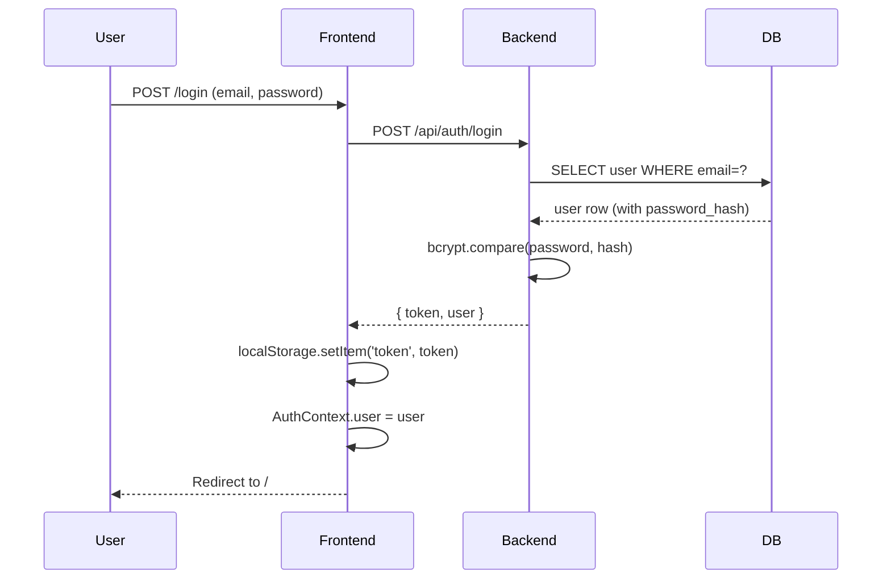
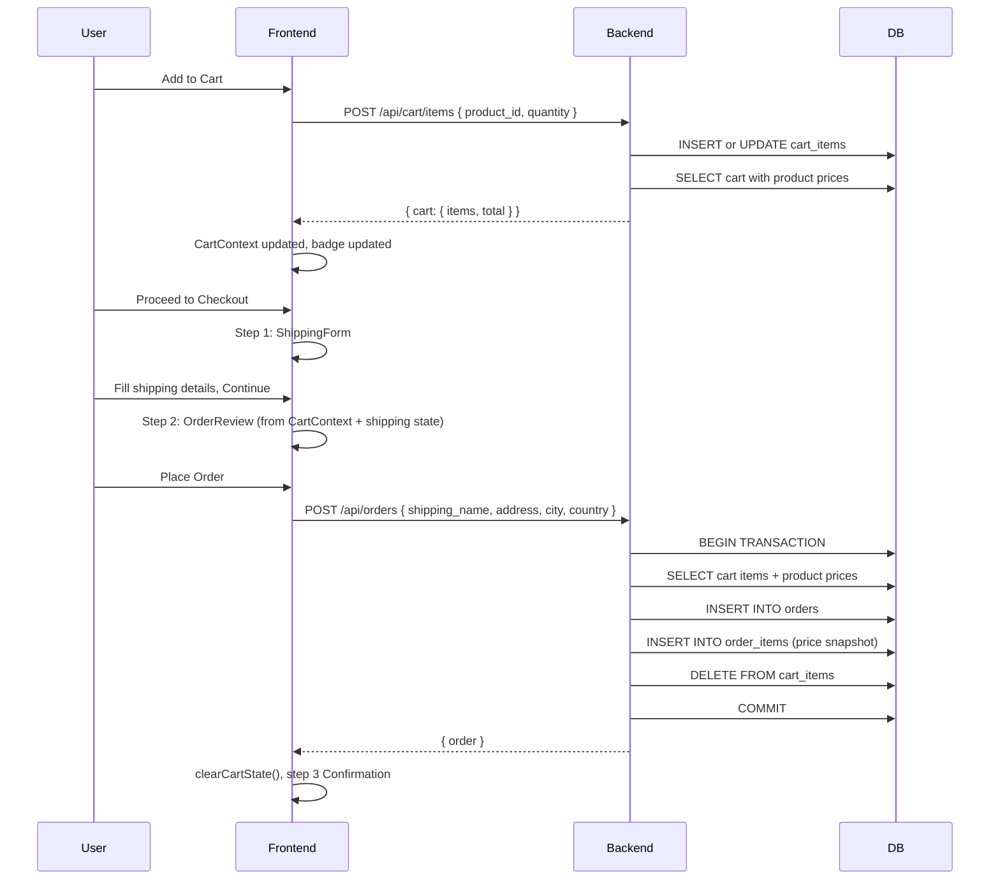

# System Architecture

---

## Monorepo Layout

```
helfy-ecommerce-assignment/
  server/          # Node.js/Express/TypeScript backend
  client/          # React/TypeScript/Vite frontend
  ai-boilerplate/  # Engineering blueprint and AI guidelines
  docs/            # AI interaction log, interventions, verification
  README.md        # Project overview and setup
  INSTRUCTIONS.md  # Reviewer quick-start
```

---

## Client / Server Split

- Backend runs on `http://localhost:4000` (configurable via `PORT`)
- Frontend runs on `http://localhost:5173` (Vite default)
- Frontend communicates with backend exclusively via REST API
- CORS is configured on the backend to allow the specific frontend origin

---

## Frontend Architecture

```
React App (Vite + TypeScript)
  App.tsx                         # BrowserRouter, route definitions
    AuthProvider                  # AuthContext: user, token, loading, auth functions
      CartProvider                # CartContext: cart state and mutations
        Layout (Navbar + Footer)
          Routes
            Public: /, /products/:id, /login, /signup
            Protected (ProtectedRoute): /cart, /checkout, /account, /orders
```

### Data Flow

```
User Action
  → Page Component (useState for local state)
    → API Module (authApi / productsApi / cartApi / ordersApi)
      → apiClient (Axios instance, token injected via interceptor)
        → Backend API
          ← JSON response
        ← Normalized data
      ← Updates Context (AuthContext / CartContext) or local state
    ← Re-render
```

### State Layers

| Layer | Tool | Scope |
|---|---|---|
| Global auth | AuthContext | User, token, isAuthenticated |
| Global cart | CartContext | Cart items, total, itemCount |
| Page-level | useState | Filters, forms, loading flags |
| No external store | — | No Redux / Zustand |

---

## Backend Architecture

```
Express App (TypeScript)
  index.ts       → starts HTTP server
  app.ts         → configures middleware, registers routes
  middleware/
    auth.middleware.ts    → verifies JWT, attaches req.user
    error.middleware.ts   → catches all errors, returns standard JSON
  routes/        → HTTP method + path → controller function
  controllers/   → parse request → call service → send response
  services/      → business logic + SQL queries
  config/db.ts   → MySQL connection pool (mysql2/promise)
```

### Layer Responsibilities

| Layer | Responsibility |
|---|---|
| Routes | Define path, method, middleware chain |
| Controllers | Extract request data, call service, format response |
| Services | Business logic, all SQL queries |
| Middleware | Auth validation, centralized error handling |
| Config/DB | Single shared connection pool |

---

## Database Schema Overview

```
users
  id, name, email, password_hash, created_at, updated_at

products
  id, name, description, price (DECIMAL 10,2), image_url, category, stock, created_at, updated_at

cart_items
  id, user_id (FK → users), product_id (FK → products), quantity, created_at, updated_at
  UNIQUE (user_id, product_id)

orders
  id, user_id (FK → users), total_amount (DECIMAL 10,2), status, shipping_name,
  shipping_address, shipping_city, shipping_country, created_at

order_items
  id, order_id (FK → orders), product_id (FK → products),
  product_name, product_price (DECIMAL 10,2), quantity
```

**Notes**:
- `order_items.product_name` and `order_items.product_price` are snapshots at time of order
- `cart_items` uses a UNIQUE constraint to prevent duplicate rows per user+product combination

---

## API Contract Overview

| Method | Path | Auth | Purpose |
|---|---|---|---|
| GET | /api/health | No | Server health check |
| POST | /api/auth/signup | No | Create account |
| POST | /api/auth/login | No | Get JWT token |
| GET | /api/auth/me | Yes | Current user profile |
| GET | /api/products | No | List products (with filters) |
| GET | /api/products/:id | No | Single product detail |
| GET | /api/cart | Yes | Get user's cart |
| POST | /api/cart/items | Yes | Add item to cart |
| PUT | /api/cart/items/:productId | Yes | Update cart item quantity |
| DELETE | /api/cart/items/:productId | Yes | Remove cart item |
| POST | /api/orders | Yes | Checkout (create order) |
| GET | /api/orders | Yes | Order history |

**Standard error format**:
```json
{
  "error": {
    "message": "User-friendly message",
    "code": "ERROR_CODE",
    "status": 400
  }
}
```

---

## Authentication Flow



**On app load**:
1. `AuthProvider` checks `localStorage` for a token
2. If token exists → `GET /api/auth/me` to validate
3. Success → populate `AuthContext.user`, set `isAuthenticated: true`
4. Failure / no token → clear localStorage, set `user: null`
5. Set `loading: false` — ProtectedRoute and Navbar now render correctly

---

## Cart and Checkout Flow



---

## Order History Flow

```
User → GET /orders
Frontend → GET /api/orders (with Bearer token)
Backend → SELECT orders WHERE user_id = req.user.userId ORDER BY created_at DESC
Backend → For each order: SELECT order_items
Backend → Return { orders: [...] } with nested items
Frontend → Render order cards with status badges and line items
```

---

## Error Handling Flow

```
Async operation in service throws error
  → Controller catch block
    → next(error) — passes to error middleware
      → error.middleware.ts
        → Log error (server-side)
        → Determine status code (from error.status or default 500)
        → In production: return generic message
        → In development: return error.message
        → Never expose stack traces to client
        → Return standard { error: { message, code, status } }
```

---

## Environment Variables

### Backend (`server/.env`)

| Variable | Description | Example |
|---|---|---|
| PORT | Server port | 4000 |
| CLIENT_URL | Frontend origin for CORS | http://localhost:5173 |
| DB_HOST | MySQL host | localhost |
| DB_PORT | MySQL port | 3306 |
| DB_USER | MySQL username | root |
| DB_PASSWORD | MySQL password | — |
| DB_NAME | Database name | helfy_ecommerce |
| JWT_SECRET | Token signing key | strong-random-string |
| JWT_EXPIRES_IN | Token TTL | 7d |

### Frontend (`client/.env.local`)

| Variable | Description | Example |
|---|---|---|
| VITE_API_URL | Backend base URL | http://localhost:4000 |

---

## Security Notes

- Passwords hashed with bcryptjs (10 rounds) — never stored plain
- JWT signed with `JWT_SECRET` from environment — never hardcoded
- SQL uses parameterized queries (`?` placeholders) — no string interpolation
- Server-side price calculation — frontend prices are never trusted
- User ownership enforced on all cart and order operations via `req.user.userId`
- `.env` files are gitignored — `.env.example` with placeholders is committed
- Password hashes are never returned in any API response
- Error middleware sanitizes stack traces in production
